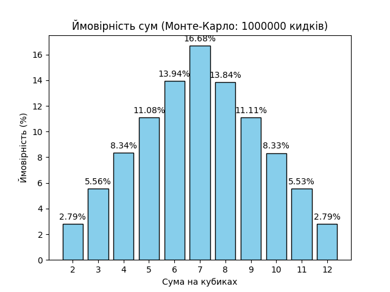

# goit-algo-fp

## Завдання 7: Монте-Карло симуляція кидків кубиків

### Порівняння результатів Монте-Карло з теоретичними ймовірностями

У цьому завданні було проведено симуляцію 1,000,000 кидків двох кубиків методом Монте-Карло для визначення ймовірностей різних сум. Результати порівнюються з теоретичними ймовірностями, розрахованими аналітично.

#### Таблиця порівняння

| Сума | Кількість | Ймовірність (Монте-Карло) | Теоретична ймовірність | Різниця |
|------|-----------|---------------------------|------------------------|---------|
| 2    | 27,633    | 2.76%                     | 2.78%                  | -0.02%  |
| 3    | 55,381    | 5.54%                     | 5.56%                  | -0.02%  |
| 4    | 83,049    | 8.30%                     | 8.33%                  | -0.03%  |
| 5    | 110,828   | 11.08%                    | 11.11%                 | -0.03%  |
| 6    | 138,544   | 13.85%                    | 13.89%                 | -0.04%  |
| 7    | 166,869   | 16.69%                    | 16.67%                 | +0.02%  |
| 8    | 139,607   | 13.96%                    | 13.89%                 | +0.07%  |
| 9    | 111,853   | 11.19%                    | 11.11%                 | +0.08%  |
| 10   | 83,279    | 8.33%                     | 8.33%                  | 0.00%   |
| 11   | 55,373    | 5.54%                     | 5.56%                  | -0.02%  |
| 12   | 27,584    | 2.76%                     | 2.78%                  | -0.02%  |

#### Візуалізація результатів

#### Аналіз результатів

1. **Точність симуляції**: Результати Монте-Карло дуже близькі до теоретичних значень. Максимальна різниця становить лише 0.08% (для суми 9), що підтверджує високу точність методу при великій кількості симуляцій.

2. **Найбільш ймовірна сума**: Як показують і теоретичні розрахунки, і симуляція Монте-Карло, найбільш ймовірною сумою є **7** з ймовірністю близько 16.67-16.69%. Це пояснюється тим, що існує найбільше комбінацій (6 варіантів) для отримання суми 7: (1,6), (2,5), (3,4), (4,3), (5,2), (6,1).

3. **Закон великих чисел**: При збільшенні кількості симуляцій (1,000,000 кидків) експериментальні ймовірності наближаються до теоретичних, що ілюструє закон великих чисел.
